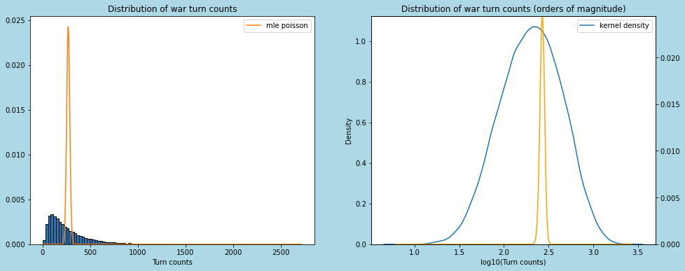
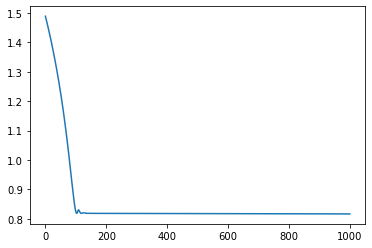
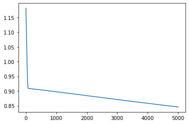
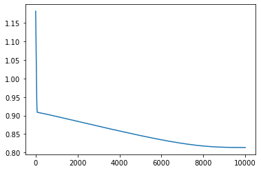
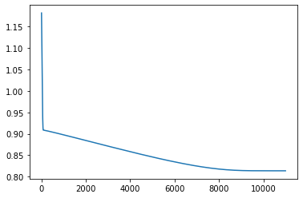
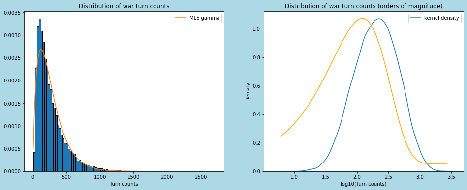

# WAR!

This is my son Oscar.  He is five.  


He recently learned how to play [war](https://en.wikipedia.org/wiki/War_(card_game)).  

The game is *not quite* deterministic, and actually *not quite* a game.  It's not really a game because it involves no choice on the part of the players, and it's not really deterministic, because the ordering of the winners cards, added to the bottom of their pile, is not determined by any rule.  

Naturally I became curious what the game's turn count distribution would look like.  You gotta figure that it's possible -- though very unlikely -- that it could resolve in a single turn:  one huge chain war.  It also seems plausible that it could go on infinitely; there would have to exist some combination of the initial ordering and orderings of all the win pots such that no player's pile ever goes all the way down to zero.  In practical terms, there's probably a very long right tail.

So let's see.  I'm going to import the class `War` from [war.py](https://github.com/cranedroesch/war/blob/main/war.py) -- which I wrote on an Amtrak train while Oscar played war with his mother -- and use it to simulate lots of games.  I'll then count their turn distribution, and see whether it corresponds with any known, stardard count distributions, like poisson or negative binomial or something.  I doubt it, but let's see.


```python
from war import War, war_sim
import multiprocessing as mp
import matplotlib.pyplot as plt
import seaborn as sns
from IPython.display import display
import numpy as np
from scipy.stats import poisson
import tensorflow as tf
from tensorflow_probability import distributions as tfd
```

Here's an example with verbose mode turned on.  I cherrypicked this seed to not have too big of a turn count.


```python
game = War(verbose = True, seed = 26)
game.play()
```

    Starting turn 1
    10, 9, p1 wins [10, 9]
    Adding pot [10, 9] to pile <queue.Queue object at 0x7f9920107d90> of size 25
    Turn end status: turn 1 p1: 27, p2: 25
    Starting turn 2
    13, 10, p1 wins [13, 10]
    Adding pot [13, 10] to pile <queue.Queue object at 0x7f9920107d90> of size 26
    Turn end status: turn 2 p1: 28, p2: 24
    Starting turn 3
    11, 5, p1 wins [11, 5]
    Adding pot [11, 5] to pile <queue.Queue object at 0x7f9920107d90> of size 27
    Turn end status: turn 3 p1: 29, p2: 23
    Starting turn 4
    13, 2, p1 wins [13, 2]
    Adding pot [13, 2] to pile <queue.Queue object at 0x7f9920107d90> of size 28
    Turn end status: turn 4 p1: 30, p2: 22
    Starting turn 5
    5, 2, p1 wins [5, 2]
    Adding pot [5, 2] to pile <queue.Queue object at 0x7f9920107d90> of size 29
    Turn end status: turn 5 p1: 31, p2: 21
    Starting turn 6
    7, 3, p1 wins [7, 3]
    Adding pot [7, 3] to pile <queue.Queue object at 0x7f9920107d90> of size 30
    Turn end status: turn 6 p1: 32, p2: 20
    Starting turn 7
    8, 4, p1 wins [8, 4]
    Adding pot [8, 4] to pile <queue.Queue object at 0x7f9920107d90> of size 31
    Turn end status: turn 7 p1: 33, p2: 19
    Starting turn 8
    6, 1, p1 wins [6, 1]
    Adding pot [6, 1] to pile <queue.Queue object at 0x7f9920107d90> of size 32
    Turn end status: turn 8 p1: 34, p2: 18
    Starting turn 9
    2, 13, p2 wins [2, 13]
    Adding pot [2, 13] to pile <queue.Queue object at 0x7f9920107f10> of size 17
    Turn end status: turn 9 p1: 33, p2: 19
    Starting turn 10
    11, 7, p1 wins [11, 7]
    Adding pot [11, 7] to pile <queue.Queue object at 0x7f9920107d90> of size 32
    Turn end status: turn 10 p1: 34, p2: 18
    Starting turn 11
    11, 4, p1 wins [11, 4]
    Adding pot [11, 4] to pile <queue.Queue object at 0x7f9920107d90> of size 33
    Turn end status: turn 11 p1: 35, p2: 17
    Starting turn 12
    6, 13, p2 wins [6, 13]
    Adding pot [6, 13] to pile <queue.Queue object at 0x7f9920107f10> of size 16
    Turn end status: turn 12 p1: 34, p2: 18
    Starting turn 13
    6, 3, p1 wins [6, 3]
    Adding pot [6, 3] to pile <queue.Queue object at 0x7f9920107d90> of size 33
    Turn end status: turn 13 p1: 35, p2: 17
    Starting turn 14
    8, 9, p2 wins [8, 9]
    Adding pot [8, 9] to pile <queue.Queue object at 0x7f9920107f10> of size 16
    Turn end status: turn 14 p1: 34, p2: 18
    Starting turn 15
    12, 10, p1 wins [12, 10]
    Adding pot [12, 10] to pile <queue.Queue object at 0x7f9920107d90> of size 33
    Turn end status: turn 15 p1: 35, p2: 17
    Starting turn 16
    9, 1, p1 wins [9, 1]
    Adding pot [9, 1] to pile <queue.Queue object at 0x7f9920107d90> of size 34
    Turn end status: turn 16 p1: 36, p2: 16
    Starting turn 17
    12, 8, p1 wins [12, 8]
    Adding pot [12, 8] to pile <queue.Queue object at 0x7f9920107d90> of size 35
    Turn end status: turn 17 p1: 37, p2: 15
    Starting turn 18
    5, 3, p1 wins [5, 3]
    Adding pot [5, 3] to pile <queue.Queue object at 0x7f9920107d90> of size 36
    Turn end status: turn 18 p1: 38, p2: 14
    Starting turn 19
    8, 1, p1 wins [8, 1]
    Adding pot [8, 1] to pile <queue.Queue object at 0x7f9920107d90> of size 37
    Turn end status: turn 19 p1: 39, p2: 13
    Starting turn 20
    6, 9, p2 wins [6, 9]
    Adding pot [6, 9] to pile <queue.Queue object at 0x7f9920107f10> of size 12
    Turn end status: turn 20 p1: 38, p2: 14
    Starting turn 21
    1, 10, p2 wins [1, 10]
    Adding pot [1, 10] to pile <queue.Queue object at 0x7f9920107f10> of size 13
    Turn end status: turn 21 p1: 37, p2: 15
    Starting turn 22
    5, 7, p2 wins [5, 7]
    Adding pot [5, 7] to pile <queue.Queue object at 0x7f9920107f10> of size 14
    Turn end status: turn 22 p1: 36, p2: 16
    Starting turn 23
    2, 4, p2 wins [2, 4]
    Adding pot [2, 4] to pile <queue.Queue object at 0x7f9920107f10> of size 15
    Turn end status: turn 23 p1: 35, p2: 17
    Starting turn 24
    3, 11, p2 wins [3, 11]
    Adding pot [3, 11] to pile <queue.Queue object at 0x7f9920107f10> of size 16
    Turn end status: turn 24 p1: 34, p2: 18
    Starting turn 25
    12, 4, p1 wins [12, 4]
    Adding pot [12, 4] to pile <queue.Queue object at 0x7f9920107d90> of size 33
    Turn end status: turn 25 p1: 35, p2: 17
    Starting turn 26
    7, 12, p2 wins [7, 12]
    Adding pot [7, 12] to pile <queue.Queue object at 0x7f9920107f10> of size 16
    Turn end status: turn 26 p1: 34, p2: 18
    Starting turn 27
    9, 13, p2 wins [9, 13]
    Adding pot [9, 13] to pile <queue.Queue object at 0x7f9920107f10> of size 17
    Turn end status: turn 27 p1: 33, p2: 19
    Starting turn 28
    10, 2, p1 wins [10, 2]
    Adding pot [10, 2] to pile <queue.Queue object at 0x7f9920107d90> of size 32
    Turn end status: turn 28 p1: 34, p2: 18
    Starting turn 29
    WAR!!! 13, 13, pot [13, 13]
    WAR! Pot: [13, 13]
    Added 10 to pot; pot now [13, 13, 10]
    Added 6 to pot; pot now [13, 13, 10, 6]
    Added 5 to pot; pot now [13, 13, 10, 6, 5]
    Added 9 to pot; pot now [13, 13, 10, 6, 5, 9]
    Added 11 to pot; pot now [13, 13, 10, 6, 5, 9, 11]
    Added 8 to pot; pot now [13, 13, 10, 6, 5, 9, 11, 8]
    Added 13 to pot; pot now [13, 13, 10, 6, 5, 9, 11, 8, 13]
    Added 9 to pot; pot now [13, 13, 10, 6, 5, 9, 11, 8, 13, 9]
    13, 9: p1 wins pot [13, 13, 10, 6, 5, 9, 11, 8, 13, 9]
    Adding pot [13, 13, 10, 6, 5, 9, 11, 8, 13, 9] to pile <queue.Queue object at 0x7f9920107d90> of size 29
    turn 29 p1: 39, p2: 13
    Turn end status: turn 29 p1: 39, p2: 13
    Starting turn 30
    2, 6, p2 wins [2, 6]
    Adding pot [2, 6] to pile <queue.Queue object at 0x7f9920107f10> of size 12
    Turn end status: turn 30 p1: 38, p2: 14
    Starting turn 31
    5, 1, p1 wins [5, 1]
    Adding pot [5, 1] to pile <queue.Queue object at 0x7f9920107d90> of size 37
    Turn end status: turn 31 p1: 39, p2: 13
    Starting turn 32
    2, 10, p2 wins [2, 10]
    Adding pot [2, 10] to pile <queue.Queue object at 0x7f9920107f10> of size 12
    Turn end status: turn 32 p1: 38, p2: 14
    Starting turn 33
    3, 5, p2 wins [3, 5]
    Adding pot [3, 5] to pile <queue.Queue object at 0x7f9920107f10> of size 13
    Turn end status: turn 33 p1: 37, p2: 15
    Starting turn 34
    WAR!!! 7, 7, pot [7, 7]
    WAR! Pot: [7, 7]
    Added 4 to pot; pot now [7, 7, 4]
    Added 4 to pot; pot now [7, 7, 4, 4]
    Added 8 to pot; pot now [7, 7, 4, 4, 8]
    Added 2 to pot; pot now [7, 7, 4, 4, 8, 2]
    Added 1 to pot; pot now [7, 7, 4, 4, 8, 2, 1]
    Added 11 to pot; pot now [7, 7, 4, 4, 8, 2, 1, 11]
    Added 6 to pot; pot now [7, 7, 4, 4, 8, 2, 1, 11, 6]
    Added 3 to pot; pot now [7, 7, 4, 4, 8, 2, 1, 11, 6, 3]
    6, 3: p1 wins pot [7, 7, 4, 4, 8, 2, 1, 11, 6, 3]
    Adding pot [7, 7, 4, 4, 8, 2, 1, 11, 6, 3] to pile <queue.Queue object at 0x7f9920107d90> of size 32
    turn 34 p1: 42, p2: 10
    Turn end status: turn 34 p1: 42, p2: 10
    Starting turn 35
    7, 12, p2 wins [7, 12]
    Adding pot [7, 12] to pile <queue.Queue object at 0x7f9920107f10> of size 9
    Turn end status: turn 35 p1: 41, p2: 11
    Starting turn 36
    11, 7, p1 wins [11, 7]
    Adding pot [11, 7] to pile <queue.Queue object at 0x7f9920107d90> of size 40
    Turn end status: turn 36 p1: 42, p2: 10
    Starting turn 37
    4, 13, p2 wins [4, 13]
    Adding pot [4, 13] to pile <queue.Queue object at 0x7f9920107f10> of size 9
    Turn end status: turn 37 p1: 41, p2: 11
    Starting turn 38
    11, 9, p1 wins [11, 9]
    Adding pot [11, 9] to pile <queue.Queue object at 0x7f9920107d90> of size 40
    Turn end status: turn 38 p1: 42, p2: 10
    Starting turn 39
    6, 2, p1 wins [6, 2]
    Adding pot [6, 2] to pile <queue.Queue object at 0x7f9920107d90> of size 41
    Turn end status: turn 39 p1: 43, p2: 9
    Starting turn 40
    3, 6, p2 wins [3, 6]
    Adding pot [3, 6] to pile <queue.Queue object at 0x7f9920107f10> of size 8
    Turn end status: turn 40 p1: 42, p2: 10
    Starting turn 41
    12, 10, p1 wins [12, 10]
    Adding pot [12, 10] to pile <queue.Queue object at 0x7f9920107d90> of size 41
    Turn end status: turn 41 p1: 43, p2: 9
    Starting turn 42
    10, 2, p1 wins [10, 2]
    Adding pot [10, 2] to pile <queue.Queue object at 0x7f9920107d90> of size 42
    Turn end status: turn 42 p1: 44, p2: 8
    Starting turn 43
    1, 5, p2 wins [1, 5]
    Adding pot [1, 5] to pile <queue.Queue object at 0x7f9920107f10> of size 7
    Turn end status: turn 43 p1: 43, p2: 9
    Starting turn 44
    9, 3, p1 wins [9, 3]
    Adding pot [9, 3] to pile <queue.Queue object at 0x7f9920107d90> of size 42
    Turn end status: turn 44 p1: 44, p2: 8
    Starting turn 45
    WAR!!! 12, 12, pot [12, 12]
    WAR! Pot: [12, 12]
    Added 8 to pot; pot now [12, 12, 8]
    Added 7 to pot; pot now [12, 12, 8, 7]
    Added 3 to pot; pot now [12, 12, 8, 7, 3]
    Added 4 to pot; pot now [12, 12, 8, 7, 3, 4]
    Added 5 to pot; pot now [12, 12, 8, 7, 3, 4, 5]
    Added 13 to pot; pot now [12, 12, 8, 7, 3, 4, 5, 13]
    Added 8 to pot; pot now [12, 12, 8, 7, 3, 4, 5, 13, 8]
    Added 3 to pot; pot now [12, 12, 8, 7, 3, 4, 5, 13, 8, 3]
    8, 3: p1 wins pot [12, 12, 8, 7, 3, 4, 5, 13, 8, 3]
    Adding pot [12, 12, 8, 7, 3, 4, 5, 13, 8, 3] to pile <queue.Queue object at 0x7f9920107d90> of size 39
    turn 45 p1: 49, p2: 3
    Turn end status: turn 45 p1: 49, p2: 3
    Starting turn 46
    1, 6, p2 wins [1, 6]
    Adding pot [1, 6] to pile <queue.Queue object at 0x7f9920107f10> of size 2
    Turn end status: turn 46 p1: 48, p2: 4
    Starting turn 47
    12, 1, p1 wins [12, 1]
    Adding pot [12, 1] to pile <queue.Queue object at 0x7f9920107d90> of size 47
    Turn end status: turn 47 p1: 49, p2: 3
    Starting turn 48
    4, 5, p2 wins [4, 5]
    Adding pot [4, 5] to pile <queue.Queue object at 0x7f9920107f10> of size 2
    Turn end status: turn 48 p1: 48, p2: 4
    Starting turn 49
    2, 1, p1 wins [2, 1]
    Adding pot [2, 1] to pile <queue.Queue object at 0x7f9920107d90> of size 47
    Turn end status: turn 49 p1: 49, p2: 3
    Starting turn 50
    10, 6, p1 wins [10, 6]
    Adding pot [10, 6] to pile <queue.Queue object at 0x7f9920107d90> of size 48
    Turn end status: turn 50 p1: 50, p2: 2
    Starting turn 51
    13, 5, p1 wins [13, 5]
    Adding pot [13, 5] to pile <queue.Queue object at 0x7f9920107d90> of size 49
    Turn end status: turn 51 p1: 51, p2: 1
    Starting turn 52
    13, 4, p1 wins [13, 4]
    Adding pot [13, 4] to pile <queue.Queue object at 0x7f9920107d90> of size 50
    Turn end status: turn 52 p1: 52, p2: 0
    GAME OVER: turn 52 p1: 52, p2: 0


    52


Now we'll simulate lots of games.  


```python
pool = mp.Pool(mp.cpu_count())
counts = pool.map(war_sim, range(50000))
pool.close()
```


```python
# I'm going to reuse this a lot...
def mainplot():
    fig, ax = plt.subplots(ncols = 2, figsize = (16, 6))
    ax[0].hist(counts, edgecolor = 'black', density = True, bins = 100)
    ax[0].set_xlabel('Turn counts')
    ax[0].set_title('Distribution of war turn counts')
    sns.kdeplot(np.log10(counts), ax=ax[1], label = 'kernel density')
    ax[1].set_xlabel('log10(Turn counts)')
    ax[1].set_title('Distribution of war turn counts (orders of magnitude)')
    ax[1].legend()
    return fig, ax
fig, ax = mainplot()
```


    

    


## It is poisson?  
Doesn't really look like it.  But it's easy to check; poisson's single parameter is the mean of the counts.  


```python
pmf = np.arange(poisson.ppf(0.01, np.mean(counts)),
                poisson.ppf(0.99, np.mean(counts)))
grid = list(range(min(counts), max(counts)))
```


```python
def log10pmf(x: np.ndarray):
    '''
    take a pmf and transform it to be a valid pmf on the log10 scale
    '''
    y = 10**x
    y-=y.min()
    y/=y.sum()
    return y
```


```python
log10pmf(poisson.pmf(grid, np.mean(counts))).sum()
```


    1.0000000000000002


```python
fig, ax = mainplot()
ax[0].plot(grid, poisson.pmf(grid, np.mean(counts)), label = 'mle poisson')
ax[0].legend()
cx1 = ax[1].twinx()
logpmf =log10pmf(poisson.pmf(grid, np.mean(counts)))
cx1.plot(np.log10(grid), logpmf, color = 'orange')
cx1.set_ylim(0, max(logpmf))

```


    (0.0, 0.024458575221015896)


    

    


Nope

### Is it negative binomial?

It certainly isn't generated by the standard definition of the number of successes before $r$ failures, with the probability of each trial being $p$.  But let's give it a whirl and see if it's a good approximation.  I'm going to use tensorflow rather than scipy because (1) I've got tensorflow code lying around, and (2) why not?


```python
r_init = 1.
p_init = .9
rate = tf.Variable([r_init])
prob = tf.Variable([p_init])
dist = tfd.NegativeBinomial(total_count = rate, probs = prob)
optimizer = tf.optimizers.Adam()
```


```python
def loss(dist, data):
    total_log_prob = -tf.reduce_mean(dist.log_prob(data))
    return total_log_prob
     
def train_step(dist, data):
    with tf.GradientTape() as g:
        loss_value = loss(dist, data)
        grads = g.gradient(loss_value, dist.trainable_variables)
    optimizer.apply_gradients(zip(grads, dist.trainable_variables))
    return loss_value
```


```python
lossvec = []
for i in range(1000):
    lossvec.append(train_step(dist, counts))
```


```python
plt.plot(np.log10(lossvec))
```


    [<matplotlib.lines.Line2D at 0x7f9950525880>]


    

    


Note that the loss should be near zero if these were in fact random draws from some negbin distribution; we've got a large sample, and there's no noise.

The estimates:


```python

dist.trainable_variables
```


    (<tf.Variable 'Variable:0' shape=(1,) dtype=float32, numpy=array([0.9954184], dtype=float32)>,
     <tf.Variable 'Variable:0' shape=(1,) dtype=float32, numpy=array([1.2453775], dtype=float32)>)


```python
fig, ax = mainplot()
ax[0].plot(grid, dist.prob(grid), label = 'MLE negbin')
ax[0].legend()
cx1 = ax[1].twinx()
logpmf = log10pmf(dist.prob(grid).numpy())
cx1.plot(np.log10(grid), logpmf, color = 'orange')
cx1.set_ylim(0, max(logpmf))
```


    (0.0, 0.0028377037961035967)


    

    


Not bad, but not great.  It's not a negbin process.

## Maybe Gamma?  
It's a count variable, rather than a positive one.  But 


```python
a_init = 10.
b_init = .1
alpha = tf.Variable([a_init])
beta = tf.Variable([b_init])
dist = tfd.Gamma(concentration = alpha, rate = beta)
optimizer = tf.optimizers.Adam()
```


```python
def loss(dist, data):
    total_log_prob = -tf.reduce_mean(dist.log_prob(data))
    return total_log_prob
     
def train_step(dist, data):
    with tf.GradientTape() as g:
        loss_value = loss(dist, data)
        grads = g.gradient(loss_value, dist.trainable_variables)
    optimizer.apply_gradients(zip(grads, dist.trainable_variables))
    return loss_value
```


```python
lossvec = []
for i in range(5000):
    lossvec.append(train_step(dist, counts))
```


```python
plt.plot(np.log10(lossvec))
```


    [<matplotlib.lines.Line2D at 0x7f9950493a00>]


    

    


Not done...


```python
for i in range(5000):
    lossvec.append(train_step(dist, counts))
```


```python
plt.plot(np.log10(lossvec))
```


    [<matplotlib.lines.Line2D at 0x7f9920573700>]


    

    


A little more..


```python
for i in range(1000):
    lossvec.append(train_step(dist, counts))
```


```python
plt.plot(np.log10(lossvec))
```


    [<matplotlib.lines.Line2D at 0x7f99504ceee0>]


    

    


```python
dist.trainable_variables
```


    (<tf.Variable 'Variable:0' shape=(1,) dtype=float32, numpy=array([1.8090765], dtype=float32)>,
     <tf.Variable 'Variable:0' shape=(1,) dtype=float32, numpy=array([0.00668677], dtype=float32)>)


```python
fig, ax = mainplot()
ax[0].plot(grid, dist.prob(grid), label = 'MLE gamma')
ax[0].legend()
cx1 = ax[1].twinx()
cx1.plot(np.log10(grid), 10**(dist.prob(grid)), color = 'orange')
cx1.axis('off')
```


    (0.5141367238566568, 3.697624369850705, 0.9996897876262665, 1.006514459848404)


    

    


### What have we learned?

We've learned that the turn counts in the game of war follows some distribution that isn't poisson, negative binomial, or gamma.  It's slightly left-skewed in log space, so it's not lognormal, that that probably wouldn't be a bad approximation.

What would the analytical distribution look like?  A mess, clearly.  It'd have to be the summation of the product of a bunch of probabilities player 1's card is greater than player 2's card, multiplied by the probability that either player has one card left, which itself would be, conditional on all preceeding terms.  And that's not thinking through what happens when there is a war.  You'd want to start with the simplest case:

$$
W(d = 2, n = 1)
$$

where $d$ is the deck size and the number of suits $n = 1$ guarantees that there will never be any wars.  You'd then generalize it.  

An analytical solution might be a cool project for the [Annals of Improbable Research](https://www.improbable.com/).

Hell, this might even be useful.  Who hasn't tried to fit a GLM to data


```python
! jupyter nbconvert --to markdown README.ipynb
```


```python

```
